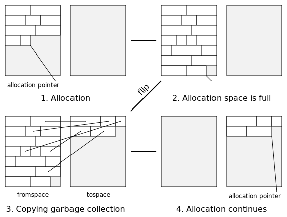
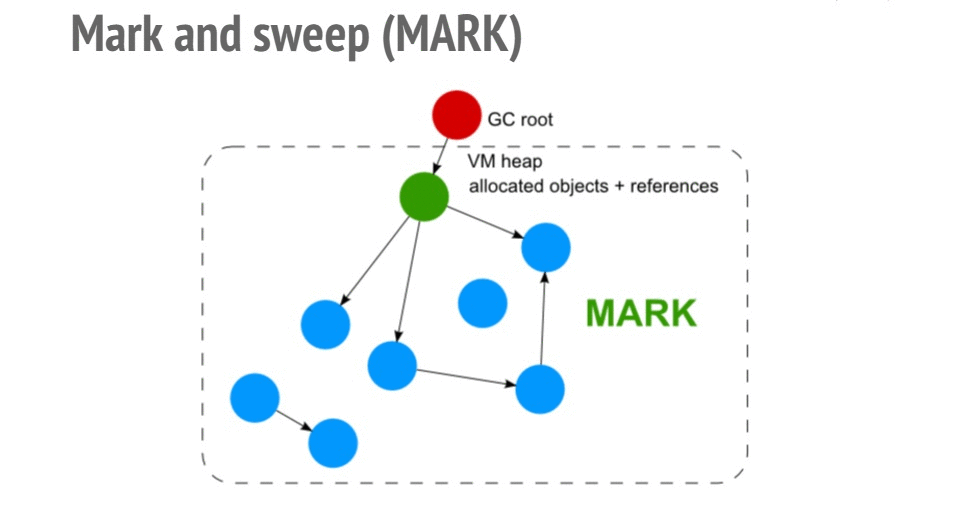

<style>
img {
  display: block;
  margin: 0 auto;
}
</style>


# Java高级程序设计

## 面向对象编程 - 续

----

# 面向对象编程

### 概念回顾

面向对象编程首先认识待解决问题所涉及的基本对象和他们间的相互关系，然后将这些现实对象映射到计算机中，实现计算机对现实问题的模拟，将“问题空间”直接映射到“解空间”。

---

# Class

- 对象的“生成模板”
  + 属性（状态）
  + 方法（行为）

```java
class Human {
    int age;
    boolean gender;
    void walk() {};
}
```

---

# UML

  

 

<br><br>
<br>
<br>
<br>

<div style="text-align: right;">PlantUML (http://www.plantuml.com/)</div>

---

# 初始化（构造）

从”对象模版“生成“对象实例“

```java
Human you = new Human();
```

- 每个对象拥有一份属性拷贝
- 对象共享方法（代码）的定义
- 每个对象有一个标识（id，内存地址）
- 通过对象引用（Object Reference）可访问对象方法和属性

---

# Object Instances in Heap

```java
class Cat {}
Cat myCat = new Cat();
```


---

# Copy by Reference

```java
class Cat {}
Cat myCat = new Cat();
Cat c = myCat;
```


---


# 构造函数/器（Constructor）

- 类的设计者通过构造器保证每个对象的初始化；
- 如果一个类有构造器，那么 Java 会在用户使用对象之前（即对象刚创建完成）自动调用对象的构造器方法，从而保证初始化；
- 构造器方法名与类名相同，不需要符合首字母小写的编程风格。
  
---

# 构造器示例

```java
class Human {
    int age; boolean gender;
    Human(){ //default constructor
        age = 0; gender = false;
    }
    Human(int age){ //overloading
        gender = true; this.age = age;
    }
    Human(boolean gender){
        this(0) //calling constructors from constructors
        this.gender = gender;
    }
}
```

---

# 无参构造器

如果你创建一个类，类中没有构造器，那么编译器就会自动为你创建一个无参构造器。

```java
class Bird {}
public class DefaultConstructor {
    public static void main(String[] args) {
        Bird bird = new Bird(); // 默认的
    }
}
```


---

# But

一旦你显式地定义了构造器（无论有参还是无参），编译器就不会自动为你创建无参构造器。
```java
class Bird2 {
    Bird2(int i) {}
    Bird2(double d) {}
}
public class NoSynthesis {
    public static void main(String[] args) {
        //- Bird2 b = new Bird2(); // No default
        Bird2 b2 = new Bird2(1);
        Bird2 b3 = new Bird2(1.0);
    }
}
```

---

# 成员变量初始化 


按在类中定义顺序逐个初始化（或赋予默认值，类的每个基本类型数据成员保证都会有一个初始值），然后执行构造函数。
```java
public class Counter {
    int i;
    Counter() {
        i = 7;
    }
    // ...
}

```
<small>https://lingcoder.github.io/OnJava8/#/book/06-Housekeeping?id=%e6%88%90%e5%91%98%e5%88%9d%e5%a7%8b%e5%8c%96</small>

---

# 初始化顺序

在类中变量定义的顺序决定了它们初始化的顺序。即使变量定义散布在方法定义之间，它们仍会在任何方法（包括构造器）被调用之前得到初始化。

```java
class Window {
    Window(int marker) {  System.out.println("Window(" + marker + ")"); }
}
class House {
    Window w1 = new Window(1); 
    House() { System.out.println("House()"); w3 = new Window(33);  }
    Window w2 = new Window(2); 
    void f() { System.out.println("f()"); }
    Window w3 = new Window(3); 
}
```

---

# Continue

```java
public class OrderOfInitialization {
    public static void main(String[] args) {
        House h = new House();
        h.f(); 
    }
}
```

输出什么？

---

## 静态变量


```java
class Human {
    static int total;

    int age;
    boolean gender;
    Human(){ //default constructor
        Human.total++;
        age = 0;
        gender = false;
    }
    ...
}

```

---

## Static Blocks

```java
class Human {
    static int total;
    static{
        total = 2; //Adam and Eve
    }
    int age;
    boolean gender;
    Human(){ //default constructor
        Human.total++;
        age = 0;
        gender = false;
    }
    ...
}

```

---

## Instance initialization

```java
class Man {
    Object girlfriend;
    {
        girlfriend = new Dog();
    }
    ...
}
```

---

# 数组初始化

```java
int a1[]; //声明但未初始化
```
```java
int[] a1 = {1, 2, 3, 4, 5};//声明且初始化
```
```java
int[] a; //声明
Random rand = new Random(47);
a = new int[rand.nextInt(20)]; //动态创建
```

---

# 数组赋值
```java
public class ArraysOfPrimitives {
    public static void main(String[] args) {
        int[] a1 = {1, 2, 3, 4, 5};
        int[] a2;
        a2 = a1;
        for (int i = 0; i < a2.length; i++) {
            a2[i] += 1;
        }
        for (int i = 0; i < a1.length; i++) {
            System.out.println("a1[" + i + "] = " + a1[i]);
        }
    }
}
```

---

# 可变参数列表-数组实现

```java
class A {}

public class VarArgs {
    static void printArray(Object[] args) { //定义成数组
        for (Object obj: args) { System.out.print(obj + " "); }
        System.out.println();
    }

    public static void main(String[] args) {
        printArray(new Object[] {47, (float) 3.14, 11.11});
        printArray(new Object[] {"one", "two", "three"});
        printArray(new Object[] {new A(), new A(), new A()});
    }
}
```

---

## 或者
```java
public class NewVarArgs {
    static void printArray(Object... args) { //定义成这样
        for (Object obj: args) { System.out.print(obj + " "); }
        System.out.println();
    }
    public static void main(String[] args) {
        // Can take individual elements:
        printArray(47, (float) 3.14, 11.11);
        printArray("one", "two", "three");
        printArray(new A(), new A(), new A());
        // Or an array:
        printArray((Object[]) new Integer[] {1, 2, 3, 4});
        printArray(); // Empty list is OK
    }
}
```

---

# `Enum` 怎么理解？

<small>Although enums appear to be a new data type, the keyword only produces some compiler behavior while generating a class for the enum, so in many ways you can treat an enum as if it were any other class. In fact, enums are classes and have their own methods.</small>

```java
enum GENDER {
    MALE, FEMALE, NOTTELLING
}

public static void main(String[] args){
    GENDER gender = GENDER.MALE; // 每个枚举值都是是枚举类型的对象示例
    System.out.println(gender.toString() + " " + gender.ordinal()) //编译器自动生成
}
```


---

# 对象消亡

垃圾回收（Garbage Collection）
- Stop-and-Copy
- Mark-and-Sweep

vs. [Reference Counting](https://en.wikipedia.org/wiki/Reference_counting)


---

# Stop-and-Copy



---

# Mark-and-Sweep



---

# 名空间 package
```java                    
package cn.edu.nju.java;

class Human{

}
```

```java   
package cn.edu.nju.another;

import cn.edu.nju.java.Human;

class Society {

}
```

---

# CLASSPATH

The class loading problem.

```bash
# /path/to/some/folder/cn/edu/nju/java/Human.class
```

```bash
set CLASSPATH=.:CLASSPATH=/path/to/some/folder:/path/to/other.jar     
java Human
```

```bash                      
cd /path/to/some/folder/
java Human
```
或者？

---

# Why package?

组织管理、避免冲突、访问控制 (请看书！)

https://lingcoder.github.io/OnJava8/#/book/07-Implementation-Hiding?id=%e5%8c%85%e7%9a%84%e6%a6%82%e5%bf%b5

---

# 访问控制

修饰符

- `public`
- `protected`
- `private`
- default

---

# `public`

对于每个人都是可用(Interface access)

```java
enum Appearance {
    BEAUTIFUL, UGLY
}
public class Human{
    public Appearance appearance;
}
```

---

# `protected`

Inheritance access

```java
public class Human{
    protected float money;
}
```
<br>
<div style="text-align: center; color: red">注：此例并不恰当</div>


---

## private

You can't touch that!


```java
enum Mood {
    GOOD, BAD
}
public class Human{
    private Mood mood;
}
```


---

## default

Package friendly

```java

enum Performance {
    GOOD, BAD
}
public class Human{
    Performance performance;
}
```


---

## Modifiers 可修饰

- class
- member
- method

<br>
<div style="text-align: center; color: red">Why? 封装 !</div> 

---

## 封装 Encapsulation


Encapsulation is to hide the implementation details from users

 <!-- .element height="40%" width="40%" --> 

---

Encapsulating for

- Flexibility
- Reusability
- Maintainability


---


## 代码重用（复用）

途径

- Composition
- Inheritance
- Delegation


---

# Composition

强合成：“部分”的生命期不能比“整体”还要长

```java
public class Heart {
    ...
}
public class Liver {
    ...
}
public class Human {
    private Heart battery;
    private Liver screen;
    ...
}
```


--- 

# 弱合成

除了“强合成”关系外，还存在“弱合成”关系

- Aggregation 聚合: “部分”可独立存在
- Association 关联: 对象可以向另一个对象通过某种方式发送消息


---

## Inheritance

继承是所有面向对象语言的一个组成部分。事实证明，在创建类时总是要继承，因为除非显式地继承其他类，否则就隐式地继承 Java 的标准根类对象（Object）。


---

# 初始化基（父）类 first

```java
class Art {
  Art() { System.out.println("Art constructor"); }
}

class Drawing extends Art {
  Drawing() { System.out.println("Drawing constructor"); }
}

public class Cartoon extends Drawing {
  public Cartoon() { System.out.println("Cartoon constructor"); }

  public static void main(String[] args) {
    Cartoon x = new Cartoon();
  }
}
```

--- 

## Delegating

什么叫委托？举个不太合适的例子：

```java
public class Car {
    public Window[] windows = new Window[4];
}

public class Jetta extends Car{

}

Car myCar = new Jetta();

//手摇式玻璃
myCar.windows[0].open();

```


--- 

## Delegating
```java
public class Car {
    public Window[] windows = new Window[4];
}

public class Tesla extends Car{
    public void openWindow(int i){
        this.windows[i].open(); //delegate
    }
}

Car hisCar = new Tesla();

//自动式玻璃
hisCar.openWindow(1);

```

--- 

## 用委托实现代码复用

In software engineering, the delegation pattern is an object-oriented design pattern that allows object composition to achieve the same code reuse as inheritance.


---

## A system class

```java

public class Window {
    private Button btnClose;

    private void btnCloseClicked(){
        ///???
    }
}

```

---

## Customizing it by extending it

```java

public class MyWindow extends Window {
    private Button btnClose;

    private void btnCloseClicked(){
        // bala bala
    }
}

```

---

## Or implementing a delegate

```java

public class Window {
    private Button btnClose;
    
    private WindowDelegate delegate;

    private void btnCloseClicked(){
        delegate.windowClosing();
    }
}

public class WindowDelegate {
    public windowClosing(){
        //bala bala
    }
}

```


<span style="color:red">Why?</span> <!-- .element: class="fragment" -->

---

## `final` 

Java的关键字`final`通常指的是“这是不能被改变的”。

https://lingcoder.github.io/OnJava8/#/book/08-Reuse?id=final%e5%85%b3%e9%94%ae%e5%ad%97

---

## `final`的变量


常量声明(经常和`static`关键字一起使用)

```java
public static final int i = 0;

i=1; // compilation errorerror

```

---

## `final`方法

代表这个方法不可以被子类的方法重写。

```java
class Father extends Man{
    public final void hitChild(){
        //beat and KO!
    }
}
class Son extends Father{
    @Override
    public final void hitChild(){ // compilation error: overridden method is final
        // beat harder ...
    }
}
```

<small>“父类中这件事已经做得够好了，子类无法超越”</small>


---

## `final`类


```java
final class Father extends Man{ 

}

class Son extends Father{ //compilation error: cannot inherit from final class

}
```

“老子整个已经不可超越”


---


## Polymorphism


多态性是指对象能够有多种形态。

- 男人是人
- 男人是动物
- 男人是一种存在

---

## 多态是”继承“的产物

```java

class Man extends Human {
    ...
}

class Human extends Creature{
    ...
} 

class Creature extends Being{
    ...
}
```

---

## 多态意味着什么？

```java
class Creature extends Being{
    public void eat(){  System.out.println("eating"); }
}
class Human extends Creature{
    @Override
    public void eat{ System.out.println("cooking...eating") }
} 
class Woman extends Human {
    @Override
    public void eat{ System.out.println("cooking...photoing...eating"); }
}

Being you = new Woman(); 
you.eat(); //??
```

---

## 再举个例子

```java
class Shape{  
    void draw(){  System.out.println("Draw Shape"); }  
}  
class Circle extends Shape{  
    void draw(){ System.out.println("Draw Circle"); }  
}   
class Triangle extends Shape{  
    void draw(){ System.out.println("Draw Triangle"); }  
}  
class Square extends Shape{  
    void draw(){ System.out.println("Draw Square"); }  
}  
public class Test {  
     public static void main(String[] args) {  
         Shape[] shapes = {new Circle(), new Triangle(), new Square()};  
         for(Shape s : shapes){  
             s.draw();  
         }  
     }  
}  
```
执行结果？


---

## 再看一个例子
```java
class Shape{  
    private void draw(){ System.out.println("Draw Shape"); }  
      
    void show(){ draw(); }  
}  
  
class Circle extends Shape{  
    void draw(){ System.out.println("Draw Circle"); }  
}  
  
public class Test {
     public static void main(String[] args) {  
         Shape s = new Circle();  
         s.show();  
     }  
}  
```
执行结果？

---

## 多态形成的条件

- 继承
- 重写
- 父类引用指向子类对象

实际上是由Java中的”动态绑定“机制造成的。<!-- .element: class="fragment" -->

---

## 动态绑定

https://stackoverflow.com/questions/19017258/static-vs-dynamic-binding-in-java


http://www.jianshu.com/p/0677f366db08


### 再想想，Why？

<div style="text-align: center; color: red">抽象思维（编程）的支撑！</div>

---

## 抽象类

当一个类没有足够的信息来描述一个具体的对象，而需要其他具体的类来支撑它，那么这样的类我们称它为抽象类。 比如：

```java
class Human {
    public void meetLouisVuitton(){
        //??
    }
}
```

---

## Abstract Class
```java
abstract class Human {
    public abstract void meetLouisVuitton();
}
class Man extends Human {
    @Override
    public void meetLouisVuitton(){
        pass();
    }
}
class Woman extends Human {
    @Override
    public void meetLouisVuitton(){
        enter();
    }
}
```

Why？应对不确定。<!-- .element: class="fragment" -->

---


## Interface

当所有行为都不确定时，干脆来一份Interface。

接口比抽象类更抽象。

接口是用来建立类与类之间的协议（protocol）。


---

## 举个例子

```java
public interface Communicate{
    public String talkTo(String message);
}

public Man extends Human implements Communicate{
    ...
    public String talkTo(String message){
        return process(message);
    }
}
public Woman extends Human implements Communicate{
    ...
    public String talkTo(String message){
        return "我不听我不听我不听";
    }
}
```

---

## Why？

抽象的行为协议定义

接口与实现的分离


---

## 实现多个接口

```java
interface A{
    public void a();
}
interface B{
    public void b();
}
class C implements A,B {
    public void a(){ ... }
    public void b(){ ... }
}
```
为什么Java不支持多继承多个父类但支持实现多个接口？

---

## 接口中的成员变量

- 成员变量必须是`public static final`

为什么? 公有化，标准化、规范化。

---


## 内部类 Inner Classes

https://lingcoder.github.io/OnJava8/#/book/11-Inner-Classes


Why Inner Classes？


---


## 作业

请改造你的葫芦娃排序


---

