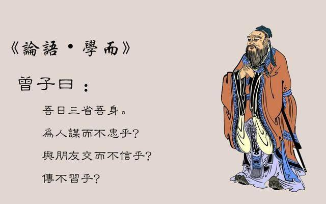

<style>
img {
  display: block;
  margin: 0 auto;
}
</style>


# Java高级程序设计

## 类型、类加载和自省

---

## SOLID


- 高内聚: S 单一职责原则，I 接口隔离原则 

- 低耦合: O 开闭原则，D 依赖倒置原则，L 里氏替换原则

<div style="text-align:center; size:24pt"> 抽象！</div>

---

## 回顾一下抽象


```java
class Shape{  
    void draw(){ System.out.println("Draw Shape"); }  
}  
class Circle extends Shape{  
    void draw(){ System.out.println("Draw Circle"); }  
}   
class Triangle extends Shape{  
    void draw(){ System.out.println("Draw Triangle"); }  
}  
class Square extends Shape{  
    void draw(){ System.out.println("Draw Square"); }  
}  
public class Test {  
     public static void main(String[] args) {  
         Shape[] shapes = {new Circle(), new Triangle(), new Square()};  
         for(Shape s : shapes){  
             s.draw();  // without knowing the concrete type of "s"
         }  
     }  
} 
```


---

# What if?


```java
abstract class Shape{  
    void draw(){ System.out.println("Draw Shape"); }  
    abstract void rotate();
}  
public class Test {  
     public static void main(String[] args) {  
         Shape[] shapes = {new Circle(), new Triangle(), new Square()};  
         for(Shape s : shapes){  
             // if s is not a circle 
             s.rotate();  // circle.rotate() means nothing!
         }  
     }  
} 
```

<div style="text-align:center; color:red">如何在不破坏抽象的原则下获得对象的实际类型？</div>


---

##  Run-time type identification (RTTI)

In computer programming, **run-time type information or run-time type identification (RTTI)** is a feature of the C++ programming language that exposes information about an object's data type at runtime. Run-time type information can apply to simple data types, such as integers and characters, or to generic types. This is a C++ specialization of a more general concept called **type introspection**. Similar mechanisms are also known in other programming languages, such as Object Pascal (Delphi).

<div style="text-align:right">--Wikipedia</div>


---

# `Class` Object


每一个类都持有其对应的`Class`类的对象的引用，其中包含着与类相关的信息

- https://docs.oracle.com/javase/8/docs/api/java/lang/Class.html

`Object`类中的`getClass()`能让我们获取到这个对象

- https://docs.oracle.com/javase/8/docs/api/java/lang/Object.html#getClass

---

## 试一下


---

## 思考一下

`Class`对象内的信息来自哪里？

针对每一个类，编译Java文件会生成一个二进制.class文件，这其中就保存着该类对应的Class对象的信息。


``` bash
javap HelloWorld.class
```

https://docs.oracle.com/javase/8/docs/technotes/tools/windows/javap.html

> Java 字节码就是类型信息

---

# Java Virtual Machine

- <small>类加载系统 （Class Loader Subsystem）</small>
- <small>执行时数据区域（Runtime Data Area）</small>
- <small>执行引擎（Execution Engine）</small>


---

# JVM languages

Apart from the **Java** language, other JVM languages are:

- <small>**Clojure**, a modern, dynamic, and functional dialect of the Lisp</small>
- <small>**Groovy**, a dynamic programming and scripting language</small>
- <small>**JRuby**, an implementation of Ruby</small>
- <small>**Jython**, an implementation of Python</small>
- <small>**Kotlin**, a statically-typed language from JetBrains</small>
- <small>**Scala**, a statically-typed object-oriented and functional programming language</small>
  
---

# 类加载系统
 
Java虚拟机运行你的代码的第一步，就是先加载你的.class文件中的类型信息到内存中。


1. 加载(Loading)。由**类加载器(Class Loaders)** 执行，查找字节码，创建一个`Class`对象。
2. 链接(Linking)。验证字节码，为静态域分配存储空间，如果必需的话，会解析这个类创建的对其他类的所有引用（比如说该类持有`static`域）。
3. 初始化(Initializing)。如果该类有超类，则对其初始化，执行静态初始化器和静态初始化块。


---

# 类加载器


Java类由[`java.lang.ClassLoader`](https://docs.oracle.com/javase/8/docs/api/java/lang/ClassLoader.html)加载。
那问题来了，`java.lang.ClassLoader`本身也是个类，谁负责加载它?

---

# Bootstrap Class Loader


**Bootstrap Class Loader** is mainly responsible for loading JDK internal classes, typically `rt.jar` and other core libraries located in `$JAVA_HOME/jre/lib` directory. 

This bootstrap class loader is part of the core JVM and is written in native code as pointed out in the above example. Different platforms might have different implementations of this particular class loader.

---

# 此外

The **extension class loader** takes care of loading the extensions of the standard core Java classes so that it's available to all applications running on the platform. It loads from the JDK extensions directory, usually `$JAVA_HOME/lib/ext` directory or any other directory mentioned in the `java.ext.dirs` system property.

The **system or application class loader** takes care of loading all the application level classes into the JVM. It loads files found in the classpath environment variable, `-classpath` or `-cp` command line option. 


---

#### Try

```java
import java.util.ArrayList;
import java.sql.Array;
public class PrintClassLoader {
    public static void main(String[] ags)  {
        System.out.println("Classloader of this class:" + PrintClassLoader.class.getClassLoader());
        System.out.println("Classloader of Array:" + Array.class.getClassLoader());
        System.out.println("Classloader of ArrayList:" + ArrayList.class.getClassLoader());
    }
}
```
```sh
Classloader of this class:jdk.internal.loader.ClassLoaders$AppClassLoader@55054057
Classloader of Array:jdk.internal.loader.ClassLoaders$PlatformClassLoader@2626b418
Classloader of ArrayList:null
```
<div style="text-align:center; color:red">注：Java 9以后Extension class loader改为Platform class loader。</div>
<div style="text-align:center; color:red">请问： 输出中 $ 代表什么？</div>

---


# 类加载器如何工作?


---

###  文字版本

- When the JVM requests a class, the class loader tries to locate the class and load the class definition into the runtime using the fully qualified class name.
- The `java.lang.ClassLoader.loadClass()` method is responsible for loading the class definition into runtime.
- If the class isn't already loaded, it delegates the request to the **parent class loader**. This process happens recursively.
- If the parent class loader doesn’t find the class, then the child class will try to look for classes in the file system itself.
- If unsucessful, it throws exception/error.


---

# When the JVM requests a class?

- `new`一个类型的对象
- `java.lang.Class.forName()`
```
public static Class<?> forName(String name, boolean initialize, ClassLoader loader)
   throws ClassNotFoundException
```
---

# Delegation Model

- Class loaders follow the delegation model where on request to find a class or resource, a ClassLoader instance will delegate the search of the class or resource to the parent class loader.

- The system class loader first delegates the loading of that class to its parent extension class loader which in turn delegates it to the bootstrap class loader.

- Only if the bootstrap and then the extension class loader is unsuccessful in loading the class, the system class loader tries to load the class itself.

---

# Unique Classes

As a consequence of the delegation model, it's easy to ensure unique classes as we always try to delegate upwards.

If the parent class loader isn't able to find the class, only then the current instance would attempt to do so itself.


---

# Visibility

In addition, children class loaders are visible to classes loaded by its parent class loaders.

For instance, classes loaded by the system class loader have visibility into classes loaded by the extension and Bootstrap class loaders but not vice-versa.

<br>
<div style="text-align:center; color:red">所以你不能写个恶意的String类型替换掉系统内部的String</div>

---

#### 自定义类加载器

```java
public class CustomClassLoader extends ClassLoader {
    @Override
    public Class findClass(String name) throws ClassNotFoundException {
        byte[] b = loadClassFromFile(name);
        return defineClass(name, b, 0, b.length);
    }
    private byte[] loadClassFromFile(String fileName)  {
        InputStream inputStream = getClass().getClassLoader().getResourceAsStream(
                fileName.replace('.', File.separatorChar) + ".class");
        byte[] buffer;
        ByteArrayOutputStream byteStream = new ByteArrayOutputStream();
        int nextValue = 0;
        try {
            while ( (nextValue = inputStream.read()) != -1 ) {
                byteStream.write(nextValue);
            }
        } catch (IOException e) {
            e.printStackTrace();
        }
        buffer = byteStream.toByteArray();
        return buffer;
    }
}
```

---

## 小结


- 所有的类都是在对其第一次使用时，动态加载到JVM中去的
- 当程序创建第一个对类的静态成员的引用时，JVM会使用类加载器来根据类名查找.class文件
- 一旦某个类的`Class`对象被载入内存，它就被用来创建这个类的所有对象
- 构造器也是类的静态方法，使用`new`操作符创建新对象会被当作对类的静态成员的引用


---

# 进内存后啥样


The method area stores per-class information

- Classloader Reference
- Run Time Constant Pool
- Field data
- Method data
- Method code


---

# 举个例子
```java
package org.jvminternals;

public class SimpleClass {

    public void sayHello() {
        System.out.println("Hello");
    }

}
```

```bash
javap -v -p -s -sysinfo -constants SimpleClass.class
```


---

# 输出
```
public class org.jvminternals.SimpleClass
  SourceFile: "SimpleClass.java"
  minor version: 0
  major version: 51
  flags: ACC_PUBLIC, ACC_SUPER
Constant pool:
  #1 = Methodref          #6.#17         //  java/lang/Object."<init>":()V
  #2 = Fieldref           #18.#19        //  java/lang/System.out:Ljava/io/PrintStream;
  #3 = String             #20            //  "Hello"
  #4 = Methodref          #21.#22        //  java/io/PrintStream.println:(Ljava/lang/String;)V
...
  #25 = Utf8               java/lang/System
  #26 = Utf8               out
  #27 = Utf8               Ljava/io/PrintStream;
  #28 = Utf8               java/io/PrintStream
  #29 = Utf8               println
  #30 = Utf8               (Ljava/lang/String;)V
```

---
```
{
  public org.jvminternals.SimpleClass();
    Signature: ()V
    flags: ACC_PUBLIC
    Code:
      stack=1, locals=1, args_size=1
        0: aload_0
        1: invokespecial #1    // Method java/lang/Object."<init>":()V
        4: return
      LineNumberTable:
        line 3: 0
      LocalVariableTable:
        Start  Length  Slot  Name   Signature
          0      5      0    this   Lorg/jvminternals/SimpleClass;
```
---
```
  public void sayHello();
    Signature: ()V
    flags: ACC_PUBLIC
    Code:
      stack=2, locals=1, args_size=1
        0: getstatic      #2    // Field java/lang/System.out:Ljava/io/PrintStream;
        3: ldc            #3    // String "Hello"
        5: invokevirtual  #4    // Method java/io/PrintStream.println:(Ljava/lang/String;)V
        8: return
      LineNumberTable:
        line 6: 0
        line 7: 8
      LocalVariableTable:
        Start  Length  Slot  Name   Signature
          0      9      0    this   Lorg/jvminternals/SimpleClass;
}
```

---


#### 为何讲这些?
> If you understand stack very well then you will understand how memory works in program and if you understand how memory works in program you will understand how function store in program and if you understand how function store in program you will understand how recursive function works and if you understand how recursive function works you will understand how compiler works and if you understand how compiler works your mind will works as compiler and you will debug any program very easily.

<small>https://stackoverflow.com/questions/10057443/explain-the-concept-of-a-stack-frame-in-a-nutshell</small>

---

## JVM Internals


<br>
<div style="text-align:right;font-size:20pt">https://blog.jamesdbloom.com/JVMInternals.html</div>

---

`Class.forName(String str)`

`Class`类的静态方法`forName(String str)`，可以让我们对于某个类不进行创建就得到它的`Class`对象的引用

```java
try {
     Class circleClass = Class.forName("Circle");
} catch (ClassNotFoundException e) {

}
```

缺点是什么？

可能有异常，且会触发类的static子句（静态初始化块）

---

## 类字面常量 Class literals 

Class literals also provide a reference to the Class object

```java
Class c = Circle.class;
```


支持编译时检查，所以不会抛出异常;不会触发类的static子句（静态初始化块）

更简单更安全更高效

---

## 基本类型的Class对象

Each object of a primitive wrapper class has a standard field called TYPE that also provides a reference to the Class object

<small>https://docs.oracle.com/javase/8/docs/api/java/lang/Integer.html#TYPE</small>

---

## 类型检查

`public boolean isInstance​(Object obj)`

> Determines if the specified Object is assignment-compatible with the object represented by this Class.

```java
if ( Shape.class.isInstance(x) ) {
     Shape s = (Shape)x;
}
```


---

## 或者

也可以使用`instanceof`关键字进行类型检查

```java
if ( x instanceof Shape ) {
     Shape s = (Shape)x;
}
```

---

## 从Class对象创建对象

```java
try {
    Class<?>  circleClass = Class.forName("Circle"); 
    Object obj = circleClass.newInstance();
} catch (ClassNotFoundException e) {

}

//or 
Class<?> circleClass = Circle.class;
Object obj = circleClass.newInstance();

```

只能得到Object类型... &lt;?&gt;又是什么鬼？

---

## 创建出实际类型的对象

```java
Class<Circle> circleClass = Circle.class;
Circle obj = circleClass.newInstance();
```

Class&lt;Circle&gt; &rarr; 范型（generic type）下次再说

---

## 问题

以上使用的RTTI都具有一个共同的限制：在编译时，编译器必须知道所有要通过RTTI来处理的类。

但有的时候，你获取了一个对象引用，然而其对应的类并不在你的程序空间中，怎么办？比如说你从磁盘文件或者网络中获取了一串字串，并且被告知这一串字串代表了一个类，这个类在编译器为你的程序生成代码之后才会出现。


---


# 自省（Introspection）
自省 Introspection： 自我评价、自我反省、自我批评、自我调控和自我教育

In computing, type introspection is the ability of a program to examine the type or properties of an object at runtime.
<div style="text-align:right">-- Wikipedia</div>

---

# Reflection
In computer science, reflection is the ability of a computer program to examine, introspect, and modify its own structure and behavior at runtime.
<div style="text-align:right">-- Wikipedia</div>

Introspection是Reflection的子集。反射除了检查，还可以控制改变。

---

## 子曰

<br><br>
<br>
<br>

> 见贤思齐焉，见不贤而内自省也


---
 


---

## Java Reflection

Java supports introspection through its [reflection library](https://www.oracle.com/technetwork/articles/java/javareflection-1536171.html).
```java
import java.lang.reflect.*;
public class DumpMethods {
    public static void main(String args[]) {
        try {
            Class c = Class.forName(args[0]);
            Method m[] = c.getDeclaredMethods();
            for (int i = 0; i < m.length; i++)
            System.out.println(m[i].toString());
        }
        catch (Throwable e) {
            System.err.println(e);
        }
    }
}
```

---

# Java Reflection


Reflection enables Java code to discover information about the fields, methods and constructors of loaded classes, and to use reflected fields, methods, and constructors to operate on their underlying counterparts, within security restrictions. The API accommodates applications that need access to either the public members of a target object (based on its runtime class) or the members declared by a given class. It also allows programs to suppress default reflective access control.

<small>https://docs.oracle.com/javase/8/docs/technotes/guides/reflection/index.html</small>

---

# 核心功能
反射的核心是 JVM 在运行时才动态加载类或调用方法/访问属性，它不需要事先（写代码的时候或编译期）知道运行对象是谁。
- 在运行时判断任意一个对象所属的类；
- 在运行时构造任意一个类的对象；
- 在运行时判断任意一个类所具有的成员变量和方法
- 在运行时调用任意一个对象的方法

<div style="text-align:right;color:red">重点：是运行时而不是编译时</div>

---

# 有啥用
- Rapid Application Development (RAD)
- Visual approach to GUI development
- Requires information about component at run-time
- Remote Method Invocation (RMI)
- Distributed objects
- 
当我们在使用 IDE(如 Eclipse，IDEA)时，当我们输入一个对象或类并想调用它的属性或方法时，一按点号，编译器就会自动列出它的属性或方法，这里就会用到反射。 更重要的用途就是<span style="color:red">开发各种通用框架<span>。


---

## Introspection in Python

The Inspect module provides introspections mechanism

https://docs.python.org/3/library/inspect.html


---


